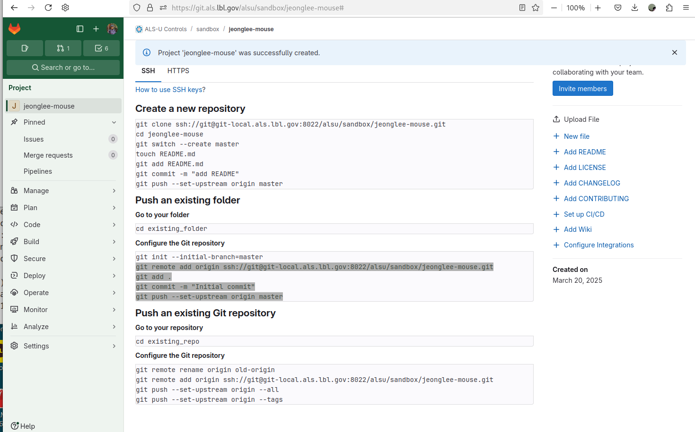
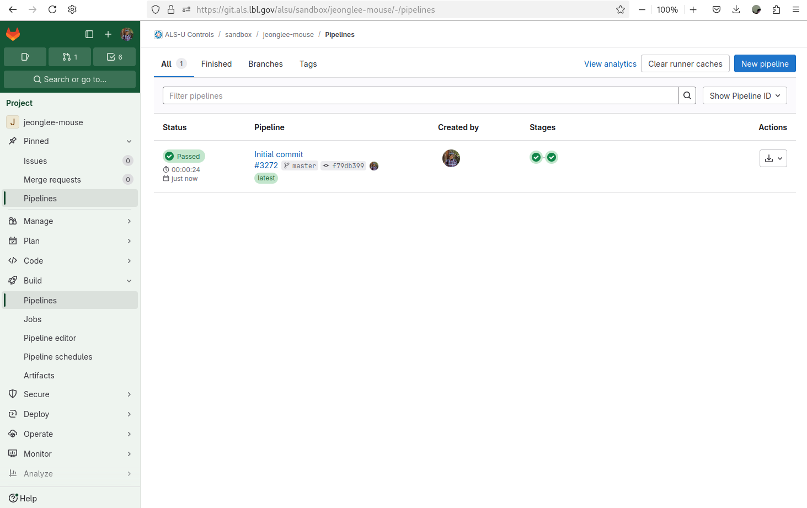
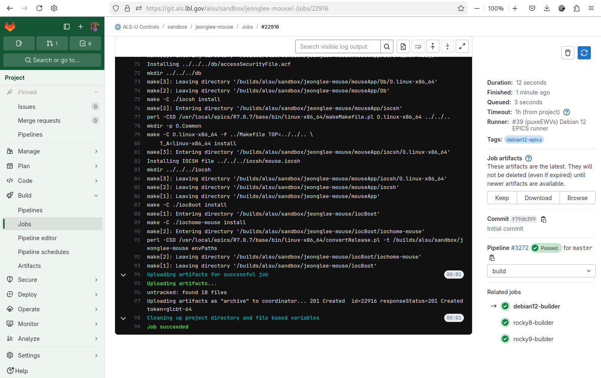
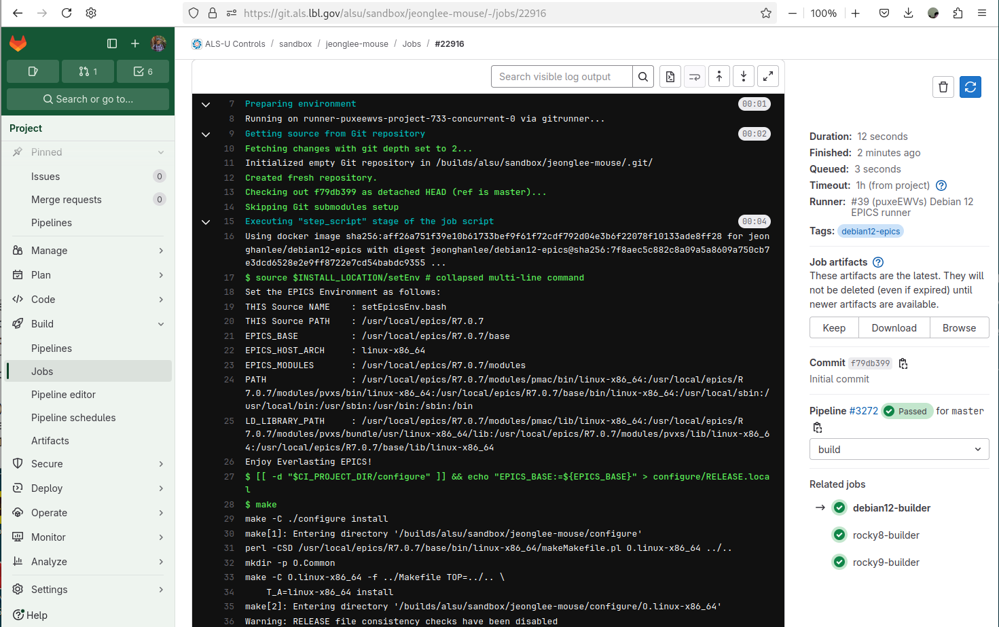
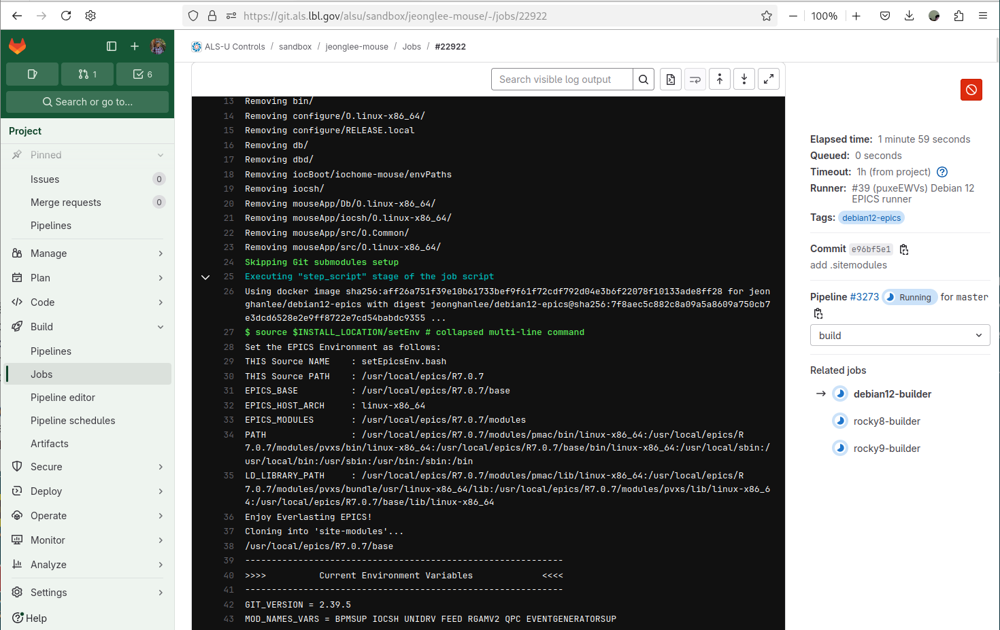

# GitLab Continuous Integration for IOC Development

This chapter details the Continuous Integration (CI) process implemented within the ALS-U GitLab environment, designed to standardize the building and testing of EPICS IOCs. You will learn how IOC projects include configuration from a central CI project (`alsu/ci`), understand the standard pipeline stages (like build and test), and crucially, discover how to conditionally incorporate necessary ALS-U site-specific modules into your CI builds using a simple `.sitmodules` trigger file. A hands-on walkthrough demonstrates pushing your IOC code to GitLab and observing the CI pipeline behavior both before and after enabling site module support.

## Lesson Overview

In this documentation, you will learn how to do the following:

* Understand how ALS-U GitLab CI configuration is applied to your IOC project. 
* Conditionally add site-specific modules to CI builds using the `.sitmodules` file.
* Create a GitLab repository for an IOC and observe the CI pipeline execution.

## Key Features

* **Centralized CI Configuration:** Includes and extends the CI from `alsu/ci` for consistent ALS-U IOC development.
* **Modular Design:** Allows customization based on specific IOC needs.
* **Multi-OS Support:** Specific configurations for Debian 12, Rocky Linux 8, and Rocky Linux 9 for EPICS.
* **Defined Stages:** CI process includes `build` and `test` stages.

## Quick Start: Integrating CI into Your IOC Project

The ALS-U IOC template generator (`tools/generate_ioc_structure.bash`) automatically creates a `.gitlab-ci.yml` file in your IOC's root directory. This file enables CI integration by referencing configurations from the central `alsu/ci` project. You typically do not need to create or manually edit the file, however understanding its components is helpful.

```yaml
include:
  # Reference files from the 'alsu/ci' project, using the 'master' branch
  # A specific tag/commit could be used instead of 'master' for long-term stability
  - project: alsu/ci
    ref: master
    file:
      # Core workflow rules and variables
      - 'workflow.yml'
      - 'alsu-vars.yml'
      # Defines jobs related to site module handling
      - 'env-sitemodules.yml'
      # Defines EPICS build/test jobs for different OS targets
      - 'debian12-epics.yml'
      - 'rocky8-epics.yml'
      - 'rocky9-epics.yml'
      # --- Optional references (uncomment if needed) ---
      # - 'debian12-analyzers.yml'
      # - 'rocky8-analyzers.yml'
      # - 'rocky9-analyzers.yml'

stages:
  - build
  - test
  # - analyzers # Uncomment if analyzer stage jobs are referenced above
  # - deploy  # Uncomment if deploy stage jobs are referenced (if implemented in alsu/ci)
```

## Understanding the Included Files

The `include:` section references several YAML files from the central `alsu/ci` project. Here's a brief overview of their purpose:

* [`workflow.yml`](https://git.als.lbl.gov/alsu/ci/-/blob/master/workflow.yml): Defines the simple rules for all CI workflow.
* [`alsu-vars.yml`](https://git.als.lbl.gov/alsu/ci/-/blob/master/alsu-vars.yml): Contains common variables (like default EPICS versions, paths), configurations, and default settings used across various ALS-U CI jobs.
* [`env-sitemodules.yml`](https://git.als.lbl.gov/alsu/ci/-/blob/master/env-sitemodules.yml): Handles environment setup and site module inclusion via `.sitmodules`.
* [`debian12-epics.yml`](https://git.als.lbl.gov/alsu/ci/-/blob/master/debian12-epics.yml), [`rocky8-epics.yml`](https://git.als.lbl.gov/alsu/ci/-/blob/master/rocky8-epics.yml), [`rocky9-epics.yml`](https://git.als.lbl.gov/alsu/ci/-/blob/master/rocky9-epics.yml): Define build/test for EPICS IOCs on respective OS.
* [`debian12-analyzers.yml`](https://git.als.lbl.gov/alsu/ci/-/blob/master/debian12-analyzers.yml), [`rocky8-analyzers.yml`](https://git.als.lbl.gov/alsu/ci/-/blob/master/rocky8-analyzers.yml), [`rocky9-analyzers.yml`](https://git.als.lbl.gov/alsu/ci/-/blob/master/rocky9-analyzers.yml): (Commented out by default) Provide template jobs for running static code analysis; users must implement the actual tool invocation commands within their project's `.gitlab-ci.yml` if they uncomment these references.

### Conditional Inclusion of Site Modules using `.sitmodules`
The standard GitLab runners (Docker images with an OS and the default ALS-U EPICS environment) do not contain pre-built ALS-U site-specific EPICS modules, such as:

* Vacuum [`dev-mks-mv2`](https://git.als.lbl.gov/alsu/epics/modules/dev-mks-mv2)
* Vacuum [`dev-mks937b-unidrv`](https://git.als.lbl.gov/alsu/epics/modules/dev-mks937b-unidrv)
* Vacuum [`dev-gamma-pctrl`](https://git.als.lbl.gov/alsu/epics/modules/dev-gamma-pctrl)
* Instrumentation [`dev-evg-support`](https://git.als.lbl.gov/alsu/epics/modules/dev-evg-support)
* Instrumentation [`dev-bpm-support`](https://git.als.lbl.gov/alsu/epics/modules/dev-bpm-support)
* RF [`dev-feed-support`](https://git.als.lbl.gov/alsu/epics/modules/dev-feed-support)

If your IOC requires one or more of these site-specific modules, you need to signal this to the CI pipeline. This is done by creating a file named `.sitmodules` in the top-level directory of your IOC repository.

The CI pipeline (specifically jobs defined in `env-sitemodules.yml`) detects the presence of this file. If `.sitmodules` exists, the CI will automatically add a predefined set of common site modules to the build environment (by cloning them) before compiling your IOC. Based on the example walkthrough below, simply creating a `.sitmodules` file seems sufficient to trigger this. (Verify this mechanism if your requirements differ or if specific modules need to be listed within the file in some cases).

## CI Stages Explaned

The stages section in your `.gitlab-ci.yml` defines the different phases of your CI pipeline. The current configuration includes:

* `build`: Compiles your IOC application code against the target EPICS environment (potentially augmented with site modules if `.sitmodules` is present). 

* `test`: Intended for running automated tests. Currently, the default jobs referenced might only execute basic checks or serve as placeholders for user-defined tests. The following stages are often available via the central CI project but commented out by default in the template:

* `analyzers`: Reserved for jobs that perform static code analysis. Users need to configure the specific tools and commands if they reference the corresponding analyzer files. 

* `deploy`: Could contain jobs for deploying build artifacts, documentation, or tagging releases.


## Let's do this! (Hands-On Example)

This walkthrough shows how to push the `mouse` IOC (created in a previous lesson) to a new GitLab repository and observe the CI pipeline.

### Create Your First Repository on GitLab

* Go to the ALS-U GitLab instance and navigate to a suitable group, like your personal sandbox area or a project group (e.g., `alsu/sandbox`). Click `New project`.

||
| :---: |
|**Figure 1** ALS-U GitLab Sandbox|

* Select `Create blank project`

||
| :---: |
|**Figure 2** ALS-U GitLab Sandbox - Create new project|


* Define your own name and Hit the `Create project`

  * `Project name` : your user accout + `mouse`, for exmaple, `jeonglee-mouse`
  * `Visibility Level` : Select `Internal`
  * `Project Configuration` : Uncheck `Initialize repository with a README`

||
| :---: |
|**Figure 3** ALS-U GitLab Sandbox - Create blank project with default selections|

||
| :---: |
|**Figure 4** ALS-U GitLab Sandbox - Your gitlab repo `jeonglee-mouse`|


### Push `mouse` to your repository

Now you are ready to push your code into the git repository you just create, for example, `jeonglee-mouse`.
Please go your created IOC folder, `mouse` and do the following commands

||
| :---: |
|**Figure 5** ALS-U GitLab Sandbox - Pushing the existing folder to your gitlab repo `jeonglee-mouse`|


```bash
mouse $ git remote add origin ssh://git@git-local.als.lbl.gov:8022/alsu/sandbox/jeonglee-mouse.git
mouse $ git add .
mouse $ git commit -m "Initial commit"
mouse $ git push --set-upstream origin master
```

### Check the CI Process

* Go to the gitlab web site, and Select `Pipelines`

||
| :---: |
|**Figure 6** ALS-U GitLab Sandbox - CI Pipelines|

* Select `Jobs`

||
| :---: |
|**Figure 7** ALS-U GitLab Sandbox - CI Jobs|

* Select `debian12-builder` within `Jobs`

||
| :---: |
|**Figure 8** ALS-U GitLab Sandbox - debian12-builder|

Congratulations! Your IOC building is done sucessfully! Now before moving forward the next step, please scroll up `debian12-builder` screen to see the process of the beginning. Note that `Enjoy Everlasting EPICS!` line is the starting point.


||
| :---: |
|**Figure 9** ALS-U GitLab Sandbox - debian12-builder - no `.sitemodule`|


### Add `.sitmodules` dependency

If your IOC requires the site specific modules, you must add `.sitmodules` file into the top of your IOC.
Please go your IOC, and add `.sitemodules` file. 

```bash
mouse (master)$ echo ".sitemodules" > .sitemodules
mouse (master)$ git add .sitemodules
mouse (master)$ git commit -m "add .sitemodules"
mouse (master)$ git push
```

### Check the CI Process

Please check `line 38` where you can find `Enjoy Everlasting EPICS!`. After this line, you can see the new log for `Cloning into 'site-modules'...`.

If you see that message, it indicates that you have configured the `.sitmodules` file correctly. Your entire CI process requires more time to compile these modules.

||
| :---: |
|**Figure 10** ALS-U GitLab Sandbox - debian12-builder - `.sitemodule`|

Please scroll down more, you can see detailed information about your sitemodules.

||
| :---: |
|**Figure 11** ALS-U GitLab Sandbox - debian12-builder - `.sitemodule`|

