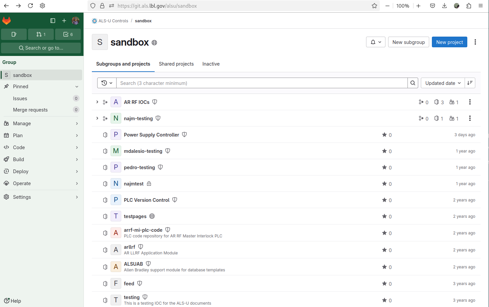
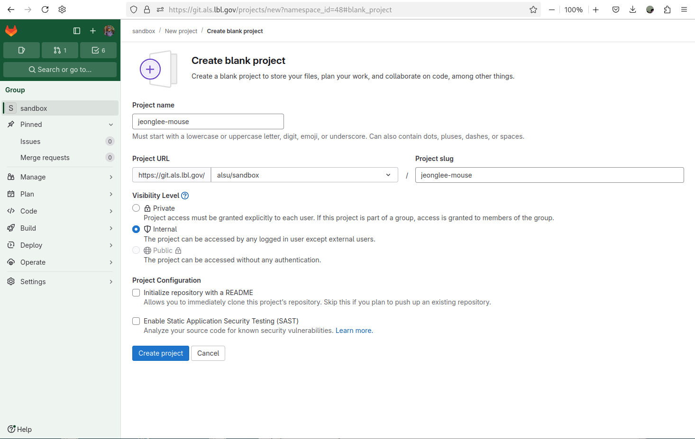
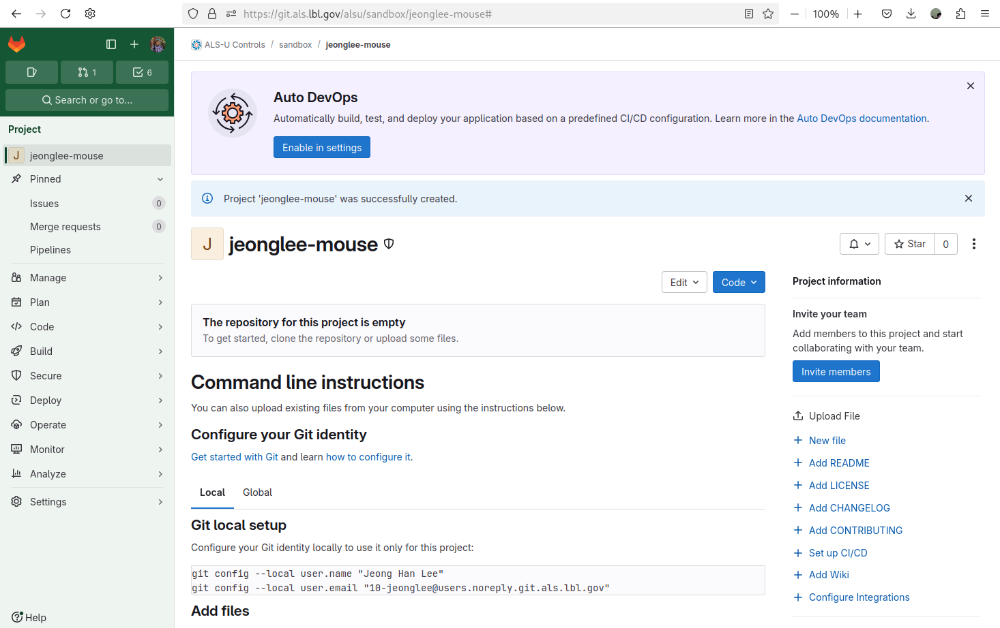
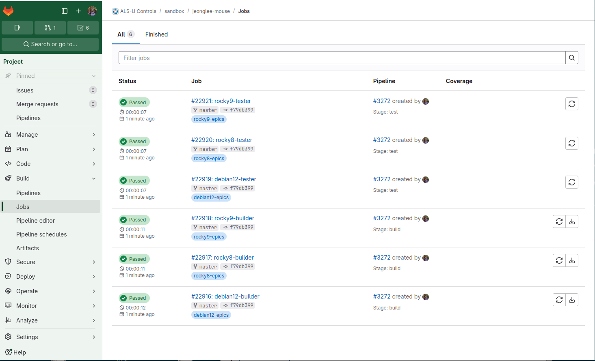
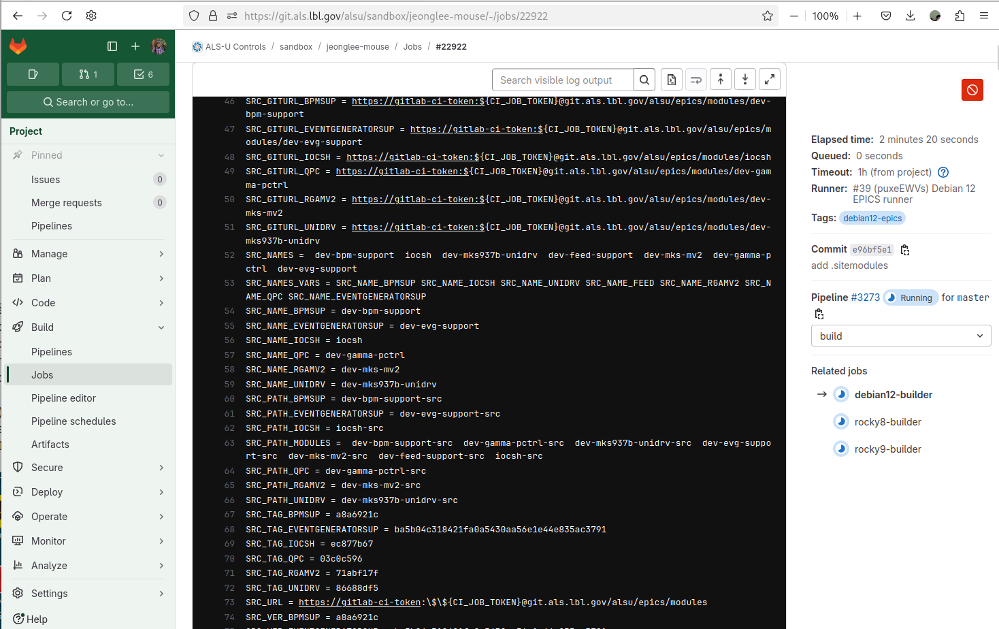

# GitLab Continuous Integration for IOC Development


## Lesson Overview

In this documentation, you will learn how to do the following:

* Integrate the ALS-U GitLab CI configuration into your IOC project.
* Conditionally include site-specific modules using the `.sitmodules` file.


This document outlines the Continuous Integration (CI) setup for developing and testing Input/Output Controllers (IOCs) at the Advanced Light Source Upgrade (ALS-U). The central CI project (`alsu/ci`) to provide standardized workflows and ensure code quality.


## Key Features

* **Centralized CI Configuration:** Includes and extends the CI from `alsu/ci` for consistent ALS-U IOC development.
* **Modular Design:** Allows customization based on specific IOC needs.
* **Multi-OS Support:** Specific configurations for Debian 12, Rocky Linux 8, and Rocky Linux 9 for EPICS.
* **Defined Stages:** CI process includes `build` and `test` stages.

## Quick Start: Integrating CI into Your IOC Project

To enable this CI in your IOC project, simply include the following in your `.gitlab-ci.yml` file at the root of your repository. However, it is done automatically through the template generator `tools`. 

```yaml
include:
  - project: alsu/ci
    ref: master # Or a specific tag/commit if needed for stability
    file:
      - 'workflow.yml'
      - 'alsu-vars.yml'
      - 'env-sitemodules.yml'
      - 'debian12-epics.yml'
      - 'rocky8-epics.yml'
      - 'rocky9-epics.yml'
      # - 'debian12-analyzers.yml' # Uncomment if analyzer stage is needed
      # - 'rocky8-analyzers.yml'  # Uncomment if analyzer stage is needed
      # - 'rocky9-analyzers.yml'  # Uncomment if analyzer stage is needed

stages:
  - build
  - test
  # - analyzers # Uncomment if analyzer stage is needed
  # - deploy  # Uncomment if deploy stage is needed (if implemented in alsu/ci)
```

## Understanding the Included Files

The include section pulls in several YAML files from the alsu/ci project. Here's a brief overview of their likely purpose:

* [`workflow.yml`](https://git.als.lbl.gov/alsu/ci/-/blob/master/workflow.yml): Defines the simple rules for all CI workflow.
* [`alsu-vars.yml`](https://git.als.lbl.gov/alsu/ci/-/blob/master/alsu-vars.yml): Contains common variables and configurations.
* [`env-sitemodules.yml`](https://git.als.lbl.gov/alsu/ci/-/blob/master/env-sitemodules.yml): Handles environment setup and site module inclusion via `.sitmodules`.
* [`debian12-epics.yml`](https://git.als.lbl.gov/alsu/ci/-/blob/master/debian12-epics.yml), [`rocky8-epics.yml`](https://git.als.lbl.gov/alsu/ci/-/blob/master/rocky8-epics.yml), [`rocky9-epics.yml`](https://git.als.lbl.gov/alsu/ci/-/blob/master/rocky9-epics.yml): Define build/test for EPICS IOCs on respective OS.
* [`debian12-analyzers.yml`](https://git.als.lbl.gov/alsu/ci/-/blob/master/debian12-analyzers.yml), [`rocky8-analyzers.yml`](https://git.als.lbl.gov/alsu/ci/-/blob/master/rocky8-analyzers.yml), [`rocky9-analyzers.yml`](https://git.als.lbl.gov/alsu/ci/-/blob/master/rocky9-analyzers.yml): (Commented out) Demo for static analysis; user implementation needed. Users must impletment how to use these tools.

### Conditional Inclusion of Site Modules
Our gitlab runners, which are dockerized OS with the default ALS-U EPICS environment, does not have the ALS-U Site Speicific EPICS modules such as

* Vacuum [`dev-mks-mv2`](https://git.als.lbl.gov/alsu/epics/modules/dev-mks-mv2)
* Vacuum [`dev-mks937b-unidrv`](https://git.als.lbl.gov/alsu/epics/modules/dev-mks937b-unidrv)
* Vacuum [`dev-gamma-pctrl`](https://git.als.lbl.gov/alsu/epics/modules/dev-gamma-pctrl)
* Instrumentation [`dev-evg-support`](https://git.als.lbl.gov/alsu/epics/modules/dev-evg-support)
* Instrumentation [`dev-bpm-support`](https://git.als.lbl.gov/alsu/epics/modules/dev-bpm-support)
* RF [`dev-feed-support`](https://git.als.lbl.gov/alsu/epics/modules/dev-feed-support)

For IOCs needing specific site modules, create a `.sitmodules` file in the top level. The CI will detect it and include the modules during build.


## CI Stages Explaned

The stages section in your `.gitlab-ci.yml` defines the different phases of your CI pipeline. The current configuration includes:

* `build`: This stage is responsible for compiling your IOC code, building any necessary dependencies, and preparing it for testing.

* `test`: This stage is reserved for further tests to verify the functionality and stability of your IOC for the future. Currently it only executes existing code analyzer tools.

The following stages are currently commented out but might be available or planned for future use in the alsu/ci project:

* `analyzers`: This stage would typically run static code analysis tools to identify potential issues and enforce coding standards.

* `deploy`: This stage contains the demonstration of how to publish the results of the previous stage `analyzers`. 

## Let's do this!

### Create your first repo at gitlab

* Go to `alsu/sandbox` and hit `New project`

||
| :---: |
|**Figure 1** ALS-U GitLab Sandbox|

* Select `Create blank project`

||
| :---: |
|**Figure 2** ALS-U GitLab Sandbox - Create new project|


* Define your own name and Hit the `Create project`

  * `Project name` : your user accout + `mouse`, for exmaple, `jeonglee-mouse`
  * `Visibility Level` : Select `Internal`
  * `Project Configuration` : Uncheck `Initialize repository with a README`

||
| :---: |
|**Figure 3** ALS-U GitLab Sandbox - Create blank project with default selections|

||
| :---: |
|**Figure 4** ALS-U GitLab Sandbox - Your gitlab repo `jeonglee-mouse`|


### Push `mouse` to your repository

Now you are ready to push your code into the git repository you just create, for example, `jeonglee-mouse`.
Please go your created IOC folder, `mouse` and do the following commands

||
| :---: |
|**Figure 5** ALS-U GitLab Sandbox - Pushing the existing folder to your gitlab repo `jeonglee-mouse`|


```bash
mouse $ git remote add origin ssh://git@git-local.als.lbl.gov:8022/alsu/sandbox/jeonglee-mouse.git
mouse $ git add .
mouse $ git commit -m "Initial commit"
mouse $ git push --set-upstream origin master
```

### Check the CI Process

* Go to the gitlab web site, and Select `Pipelines`

||
| :---: |
|**Figure 6** ALS-U GitLab Sandbox - CI Pipelines|

* Select `Jobs`

||
| :---: |
|**Figure 7** ALS-U GitLab Sandbox - CI Jobs|

* Select `debian12-builder` within `Jobs`

||
| :---: |
|**Figure 8** ALS-U GitLab Sandbox - debian12-builder|

Conguration! Your IOC building is done sucessfully! Now before moving forward the next step, plase ccroll up `debian12-builder` screen to see the process of the beginning. Note that `Enjoy Everlasting EPICS!` line is the starting point.


||
| :---: |
|**Figure 9** ALS-U GitLab Sandbox - debian12-builder - no `.sitemodule`|


### Add `.sitmodules` dependency

If your IOC requires the site speicific modules, you must add `.sitmodules` file into the top of your IOC.
Please go your IOC, and add `.sitemodules` file. 

```bash
mouse (master)$ echo ".sitemodules" > .sitemodules
mouse (master)$ git add .sitemodules
mouse (master)$ git commit -m "add .sitemodules"
mouse (master)$ git push
```

### Check the CI Process

Please check `line 38` where you can find `Enjoy Everlasting EPICS!`. After this line, you can see the new log for `Cloning into 'site-modules'...`.

If you see that message, it indicates that you have configured the `.sitmodules` file correctly. Your entire CI process requires more time to compile these modules.

||
| :---: |
|**Figure 10** ALS-U GitLab Sandbox - debian12-builder - `.sitemodule`|

Please scroll down more, you can see detailed information about your sitemodules.

||
| :---: |
|**Figure 11** ALS-U GitLab Sandbox - debian12-builder - `.sitemodule`|

